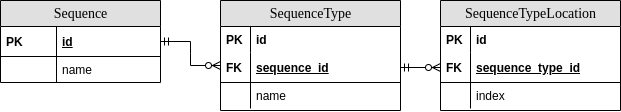

# Genomics ETL POC

This repository hosts a ETL pipeline designed for a toy dataset mimicking a genomics dataset.

It transforms the dataset into an analysable format that enables easy querying for the discovery of overlaps between 
sequences.

## Assumptions

When cleaning this data, a number of assumptions are made:

1. The `id` column has no significance beyond being a database id
2. Duplicate entries have no significance
3. Sequence-type pairs are unique
4. When there are two `start` events, the earliest `location` is true
5. Events of type `unclear_read` signal that this sequence-type exists at this location
6. If the start event is less than the end event, treat them in reverse

## Development Environment Setup

- Install [Miniconda](https://docs.conda.io/en/latest/miniconda.html)
- Create an environment `conda create -n genomics_etl python=3.9 -y`
- Activate your new environment `conda activate genomics_etl`
- Install this package in editable mode `pip install -e .`

## Entity Relationship Diagram

## Run

To run the ETL pipeline with queries showing overlaps between sequence execute
`python genomics_etl/__init__.py` from a terminal
